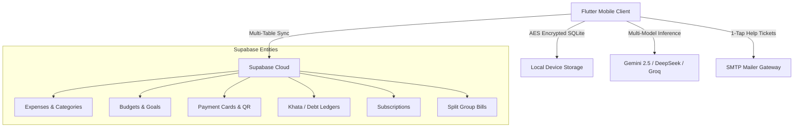

# 🟢 Grow Expense App (v2.5)

[](https://growexpense.vercel.app)
[](https://flutter.dev)
[](https://growexpense.vercel.app)
[](https://github.com/Rupam852/Expense-App/releases)

**Grow Expense** is an ultra-premium, local-first personal finance tracker, accounting ledger, and AI financial advisor. Designed with a sleek glassmorphic UI, fluid dark/light themes, and offline-first encrypted storage, it puts total control of your money back in your pocket.

---

## 🌟 Core Philosophy: Privacy-First & Local-First

Unlike conventional finance apps that harvest and sell personal transaction logs to third parties, Grow Expense functions as a **secure offline enclave**:
* **100% Offline-First:** All accounts, payment cards, khata ledgers, and expense logs remain encrypted locally on your device inside an AES-encrypted SQLite sandbox.
* **No Account Required:** Launch the app and begin budgeting immediately—no mandatory logins or phone number requirements.
* **Encrypted Multi-Device Cloud Backup:** Optional 1-tap real-time synchronization with private Supabase cloud across 6 distinct entities.

---

## ✨ What's New in v2.5 & Key Features

### 🤖 1. Multi-Model AI Hub & Smart Financial Advisor
* **Multi-Provider Support:** Built-in integration with **Google Gemini 2.5** (Flash, Pro, Flash-Lite), **Groq** (Llama 3.3 70B), and **DeepSeek** (R1, V3).
* **Bring-Your-Own-Key (BYOK):** Use free default keys or supply your own custom API keys stored securely in Android KeyStore (`FlutterSecureStorage`).
* **AI Model Health Monitor:** Real-time 45-second rate-limited health check button to verify API connectivity and latency without quota exhaustion.
* **AI Financial Coach:** Context-aware budgeting tips, category spending analysis, and monthly savings recommendations.

### 💳 2. Payment Cards & Dynamic Custom UPI QR
* **Visual Card Management:** Store Debit, Credit, and Bank accounts with sleek gradient card aesthetics (Visa, Mastercard, RuPay, Bank, UPI).
* **Dynamic UPI QR Code Generator:** Instantly generate custom QR codes with pre-filled amounts for fast peer-to-peer payments and settlements.
* **Real-time Deletion & Edit Sync:** Instant cross-device synchronization and cleanup for removed cards.

### 🎙️ 3. Mandi Voice Calculator & Financial Tools Hub
* **Mandi Voice Arithmetic:** Speak wholesale market and trade calculations naturally in Hindi or English (e.g., *"50 kg aalu at 22 rupee plus 10 kg pyaj at 35"*). The AI automatically parses quantities, rates, and totals.
* **Financial Calculators Hub:**
  * 📈 **Loan & EMI Calculator:** Monthly amortization breakdown and interest ratios.
  * 💰 **SIP & Wealth Growth Planner:** Long-term compounding growth calculator with inflation adjustments.
  * 🧾 **GST & Tax Calculator:** Exclusive/Inclusive tax split and business invoice breakdown.

### 📨 4. 1-Tap Direct Help & SMTP Issue Diagnosis
* **Built-in Support Ticket Engine:** Tap "Help / Report" in any error popup or Settings to directly dispatch issue logs and suggestions to the developer email (`rupambairagiya08@gmail.com`).
* **Zero Intermediary:** Powered by secure backend SMTP email services with instant delivery.

### 📖 5. Khata (Udhar Book) & 1-Tap WhatsApp Reminders
* Track money lent to friends or borrowed from colleagues.
* Set repayment due dates, log partial payments, and send friendly WhatsApp payment reminder messages containing your direct UPI payment link in one tap.

### 👥 6. Split Bills & Group Expenses
* Divide dinner bills, road trips, or room rent evenly or with custom per-person splits.
* Share formatted WhatsApp breakdown summaries with direct settlement links.

### 📄 7. Smart OCR Receipt Scanner & PDF Statement Rollovers
* **OCR Bill Scanner:** Point your camera at receipts to automatically parse merchants, dates, item lines, and payment types.
* **Monthly Rollover PDFs:** Compile structured, professional PDF invoices directly into your device's `Downloads` folder before clearing monthly ledgers.

### 🔒 8. Native Biometric Security & Fluid Themes
* Native Android `BiometricPrompt` fingerprint and face recognition protection.
* Fluid glassmorphic dark mode and high-contrast light mode with Web Audio tactile haptic feedback.

---

## 🛠️ Repository Structure

```
├── frontend/             # Flutter mobile application codebase (Dart)
│   ├── lib/
│   │   ├── screens/      # Dashboard, AI Advisor, AI Config, Mandi Calc, Cards & QR, Khata, Settings
│   │   ├── services/     # SQLite DB, Supabase Service, AI Config Service, Biometrics, SMTP Mailer
│   │   ├── widgets/      # Glassmorphic cards, Help popups, Export statement dialogs
│   └── pubspec.yaml      # Dependencies & assets configuration
│
├── backend/              # Node.js Express server backend (Optional / Legacy PostgreSQL fallback)
│   ├── routes/           # Auth, analytics, statement parsing, and mailer routes
│   └── server.js         # Keep-alive cron & API entry point
│
├── index.html            # Marketing landing page with interactive simulator & split APK modal
├── index.css             # Responsive design tokens & glassmorphic styling
├── index.js              # GPU-accelerated spotlight, simulator logic, & 45s AI test demo
└── logo.png              # App branding asset
```

---

## ☁️ Backend Architecture & Supabase Sync


```mermaid
graph TD
    A[Flutter Mobile Client] -->|AES Encrypted SQLite| B[Local Device Storage]
    A -->|Multi-Table Sync| C[Supabase Cloud]
    A -->|Multi-Model Inference| D[Gemini 2.5 / DeepSeek / Groq]
    A -->|1-Tap Help Tickets| E[SMTP Mailer Gateway]
    
    subgraph Supabase Entities
        C --> C1[Expenses & Categories]
        C --> C2[Budgets & Goals]
        C --> C3[Payment Cards & QR]
        C --> C4[Khata / Debt Ledgers]
        C --> C5[Subscriptions]
        C --> C6[Split Group Bills]
    end
```

---

## 🚀 Setup & Build Instructions

### 1. Prerequisites
* [Flutter SDK](https://docs.flutter.dev/get-started/install) (`>= 3.3.0`)
* Android Studio / Xcode (for Android/iOS compilation)

### 2. Running Locally (Development Mode)
```bash
# Navigate to the frontend directory
cd frontend

# Install Flutter dependencies
flutter pub get

# Launch on connected device or emulator
flutter run
```

### 3. Building Optimized Split Release APKs (Recommended)
Building architecture-specific split APKs reduces download size by **~62%** (from ~72MB down to ~27MB):

```bash
# Build optimized Split APKs with icon tree-shaking
flutter build apk --split-per-abi --release --tree-shake-icons
```

**Generated Split APK Output Locations:**
* 📱 **ARM 64-bit (`app-arm64-v8a-release.apk`):** `27.57 MB` *(Recommended for 95%+ of modern Android phones)*
* 📱 **ARM 32-bit (`app-armeabi-v7a-release.apk`):** `26.34 MB` *(For older 32-bit devices)*
* 💻 **x86_64 (`app-x86_64-release.apk`):** `29.21 MB` *(For emulators and Chromebooks)*
* 📦 **Universal Fat APK (`app-release.apk`):** `72.68 MB` *(All architectures combined)*

---

## 🛡️ Security & Privacy Standards
* **Local-First Isolation:** No transaction logs or sensitive financial details are transmitted to public analytics engines.
* **Hardware Keystore:** API keys and credentials are encrypted via Android Keystore / iOS Keychain (`FlutterSecureStorage`).
* **Row-Level Security (RLS):** Supabase database tables enforce strict RLS policies bound to `auth.uid()`.

---

## 👨‍💻 Developer & Contact
Crafted with ❤️ by **Rupam Bairagya**

* **Developer Email:** [rupambairagiya08@gmail.com](mailto:rupambairagiya08@gmail.com)
* **GitHub:** [github.com/Rupam852/Expense-App](https://github.com/Rupam852/Expense-App)
* **Website:** [growexpense.vercel.app](https://growexpense.vercel.app)
* **Instagram:** [@_rupambairagya_](https://instagram.com/_rupambairagya_)
* **LinkedIn:** [linkedin.com/in/rupam-bairagya](https://linkedin.com/in/rupam-bairagya)
* **Support / UPI:** `expensetracker@ybl`
